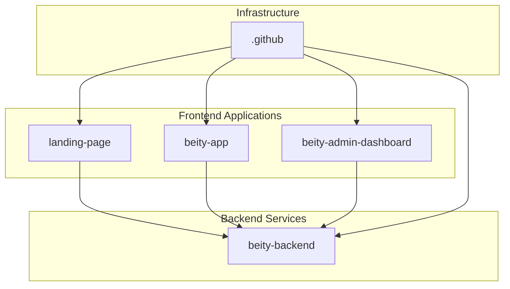
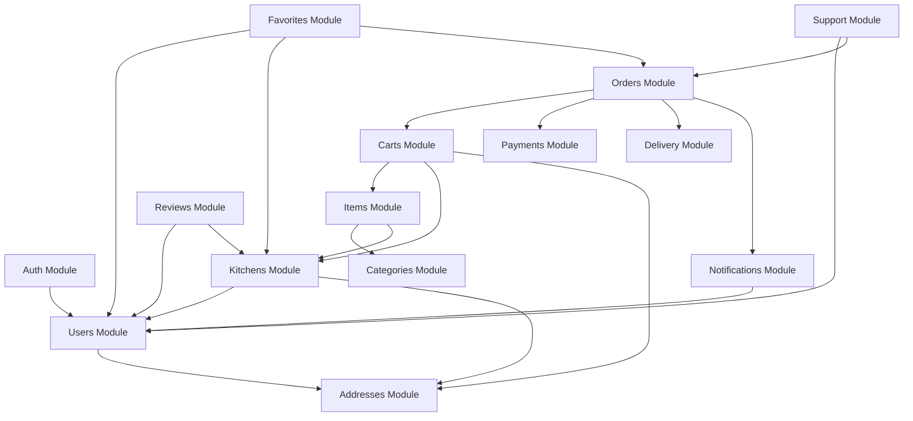
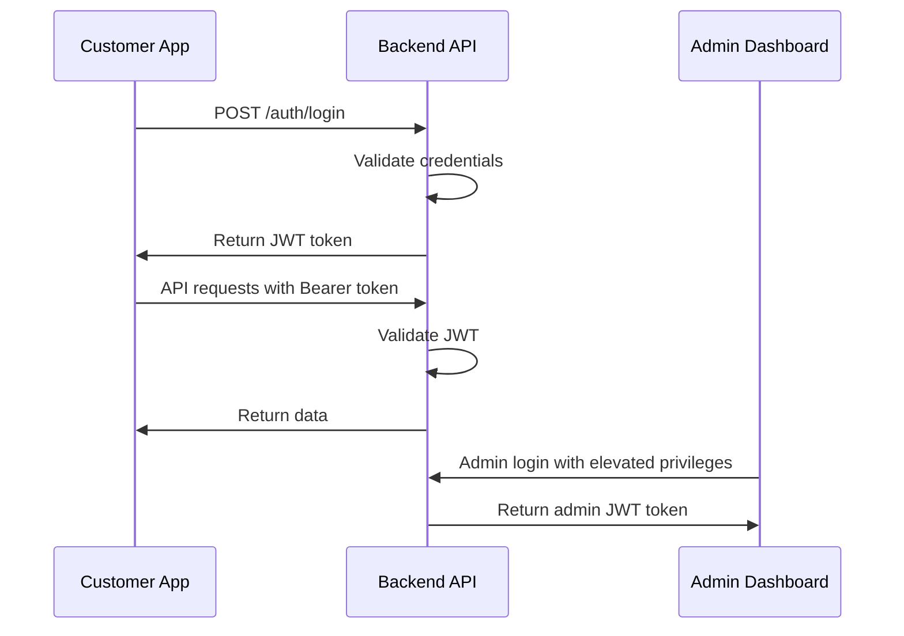
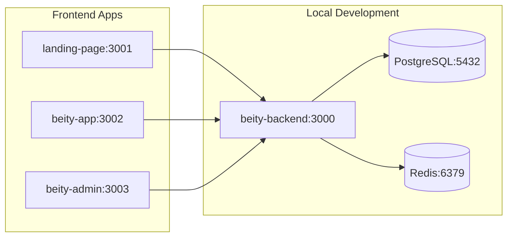
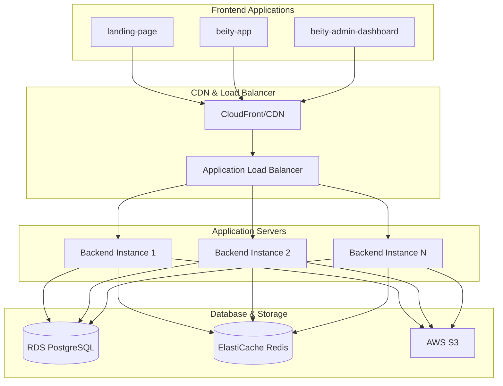
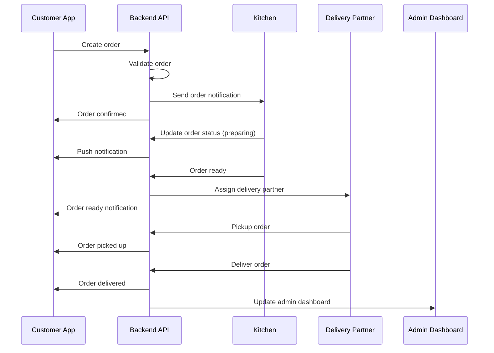
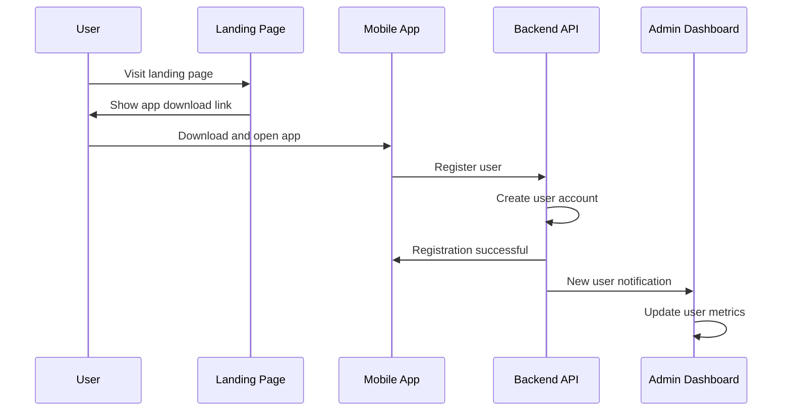

# 🏗️ Beity Platform - Modular Monolith Architecture

## 📋 Overview

**Beity** is a comprehensive food delivery platform that connects home cooks, cloud kitchens, and customers through a seamless ordering experience. The platform is built using a **Modular Monolith** architecture pattern, providing the benefits of microservices while maintaining the simplicity of a monolithic deployment.

## 🎯 Architecture Philosophy

### Why Modular Monolith?

The Beity platform adopts a **Modular Monolith** architecture for the following reasons:

- **🚀 Rapid Development**: Single codebase enables faster feature development
- **🔧 Easy Refactoring**: Clear module boundaries make code changes manageable
- **📦 Simple Deployment**: Single deployment unit reduces operational complexity
- **🔄 Future-Proof**: Modules can be extracted to microservices as the platform scales
- **👥 Team Autonomy**: Different teams can work on different modules independently
- **🧪 Easier Testing**: Comprehensive testing across module boundaries

### Architecture Principles

1. **Domain-Driven Design (DDD)**: Each module represents a business domain
2. **Clean Architecture**: Clear separation of concerns across layers
3. **Dependency Inversion**: High-level modules don't depend on low-level modules
4. **Single Responsibility**: Each module has a single, well-defined purpose
5. **Loose Coupling**: Modules communicate through well-defined interfaces

## 🏢 Repository Structure

The Beity platform consists of **5 interconnected repositories**:

```
📁 Beity Platform
├── 🍴 beity-backend          # Core API & Business Logic
├── 🌐 landing-page           # Marketing Website
├── 📱 beity-app             # Customer Mobile App
├── 🛠️ beity-admin-dashboard # Admin Management Panel
└── 📋 .github               # CI/CD & Project Configuration
```

### Repository Relationships



## 🍴 beity-backend (Core API)

### 🏗️ Architecture Overview

The backend follows **Clean Architecture** with **Modular Monolith** pattern:

```
src/
├── modules/                    # Business domain modules
│   ├── auth/                  # Authentication & Authorization
│   ├── users/                 # User management
│   ├── kitchens/              # Kitchen/Store management
│   ├── menu/                  # Product catalog
│   ├── orders/                # Order processing
│   ├── payments/              # Payment processing
│   ├── delivery/              # Delivery management
│   ├── notifications/         # Notification system
│   └── reviews/               # Review system
├── shared/                    # Shared infrastructure
└── bootstrap/                 # Application bootstrap
```

### 🧩 Module Architecture

Each module follows the **Clean Architecture** pattern:

```
modules/[module-name]/
├── domain/           # Business entities & repository interfaces
├── application/      # Use cases & business logic
├── infrastructure/   # Database implementations (Prisma)
├── interface/        # Controllers & API endpoints
├── dtos/            # Data Transfer Objects
└── [module].module.ts # Module configuration
```

### 🔄 Module Dependencies



### 🛠️ Technology Stack

- **Framework**: NestJS with TypeScript
- **Database**: PostgreSQL with Prisma ORM
- **Cache**: Redis for session management
- **Authentication**: JWT with refresh tokens
- **Payment**: Paymob, Apple Pay integration
- **File Storage**: AWS S3, Cloudinary
- **Documentation**: Swagger/OpenAPI
- **Testing**: Jest for unit and integration tests

## 🌐 landing-page (Marketing Website)

### Purpose
- **Customer Acquisition**: Attract new customers and kitchen partners
- **Brand Awareness**: Showcase Beity's value proposition
- **Lead Generation**: Collect contact information from potential partners
- **SEO Optimization**: Improve search engine visibility

### Key Features
- **Responsive Design**: Mobile-first approach
- **Performance Optimized**: Fast loading times
- **SEO Friendly**: Meta tags, structured data
- **Analytics Integration**: Track user behavior
- **Contact Forms**: Lead generation capabilities

### Technology Stack
- **Framework**: Next.js or React
- **Styling**: Tailwind CSS or styled-components
- **Deployment**: Vercel or Netlify
- **Analytics**: Google Analytics, Hotjar

### Integration with Backend
- **API Endpoints**: Fetches kitchen listings, testimonials
- **Contact Forms**: Submits to backend for lead management
- **Authentication**: Redirects to mobile app for signup/login

## 📱 beity-app (Customer Mobile App)

### Purpose
- **Customer Experience**: Primary interface for food ordering
- **Order Management**: Browse, order, and track deliveries
- **User Engagement**: Push notifications, loyalty programs
- **Payment Processing**: Secure payment handling

### Key Features
- **User Authentication**: Login, registration, social login
- **Kitchen Discovery**: Browse nearby kitchens with filters
- **Menu Browsing**: View menus, categories, dietary options
- **Shopping Cart**: Add items, manage quantities
- **Order Tracking**: Real-time order status updates
- **Payment Integration**: Multiple payment methods
- **Push Notifications**: Order updates, promotions
- **Reviews & Ratings**: Rate and review experiences

### Technology Stack
- **Framework**: React Native or Flutter
- **State Management**: Redux, Zustand, or Provider
- **Navigation**: React Navigation or Flutter Navigation
- **Maps**: Google Maps or Mapbox
- **Push Notifications**: Firebase Cloud Messaging
- **Analytics**: Firebase Analytics, Mixpanel

### Integration with Backend
- **REST APIs**: All CRUD operations
- **Real-time Updates**: WebSocket connections for live tracking
- **Authentication**: JWT token management
- **File Upload**: Image upload for reviews
- **Payment Processing**: Secure payment flow

## 🛠️ beity-admin-dashboard (Admin Panel)

### Purpose
- **Platform Management**: Oversee all platform operations
- **Kitchen Onboarding**: Approve and manage kitchen registrations
- **Order Monitoring**: Track and manage orders across the platform
- **Analytics & Reporting**: Business intelligence and insights
- **Content Management**: Manage categories, promotions, content

### Key Features
- **Dashboard Analytics**: Real-time platform metrics
- **Kitchen Management**: Approve, suspend, manage kitchens
- **Order Management**: View, modify, cancel orders
- **User Management**: Customer and kitchen user management
- **Payment Management**: Monitor transactions, handle refunds
- **Content Management**: Categories, promotions, banners
- **Support System**: Handle customer and kitchen support tickets
- **Reporting**: Generate business reports and analytics

### Technology Stack
- **Framework**: React with TypeScript
- **UI Library**: Material-UI, Ant Design, or Chakra UI
- **State Management**: Redux Toolkit or Zustand
- **Charts**: Chart.js, Recharts, or D3.js
- **Data Tables**: React Table or Material-UI DataGrid
- **Forms**: React Hook Form or Formik

### Integration with Backend
- **Admin APIs**: Specialized admin endpoints
- **Real-time Data**: Live updates for orders and metrics
- **File Management**: Upload and manage platform content
- **Bulk Operations**: Mass actions for efficiency

## 📋 .github (CI/CD & Configuration)

### Purpose
- **Automated Workflows**: CI/CD pipelines for all repositories
- **Code Quality**: Automated testing and linting
- **Deployment**: Automated deployment to staging/production
- **Documentation**: Automated documentation generation
- **Security**: Automated security scanning

### Key Features
- **GitHub Actions**: Automated workflows
- **Docker Integration**: Containerized deployments
- **Environment Management**: Staging and production environments
- **Security Scanning**: Automated vulnerability detection
- **Performance Monitoring**: Automated performance testing

## 🔗 Repository Communication

### API Contracts

All frontend applications communicate with the backend through well-defined REST APIs:

```typescript
// Example API contract
interface KitchenAPI {
  // Get nearby kitchens
  GET /api/kitchens/nearby?lat=30.0444&lng=31.2357&radius=5000
  
  // Get kitchen details
  GET /api/kitchens/:id
  
  // Get kitchen menu
  GET /api/kitchens/:id/menu
  
  // Create order
  POST /api/orders
  Body: {
    kitchenId: string
    items: OrderItem[]
    deliveryAddress: Address
    paymentMethod: PaymentMethod
  }
}
```

### Shared Data Models

Common data models are shared across repositories:

```typescript
// Shared types across repositories
interface User {
  id: string
  email: string
  name: string
  phone: string
  role: UserRole
  addresses: Address[]
}

interface Kitchen {
  id: string
  name: string
  description: string
  location: GeoLocation
  rating: number
  isOpen: boolean
  categories: Category[]
}

interface Order {
  id: string
  userId: string
  kitchenId: string
  items: OrderItem[]
  status: OrderStatus
  totalAmount: number
  deliveryAddress: Address
  createdAt: Date
}
```

### Authentication Flow



## 🚀 Deployment Architecture

### Development Environment



### Production Environment



## 🔄 Data Flow

### Order Processing Flow



### User Registration Flow



## 🧪 Testing Strategy

### Backend Testing

```typescript
// Unit Tests
describe('OrderService', () => {
  it('should create order successfully', async () => {
    // Test order creation logic
  });
  
  it('should validate order items', async () => {
    // Test validation logic
  });
});

// Integration Tests
describe('Order API', () => {
  it('should create order via API', async () => {
    // Test full API flow
  });
});
```

### Frontend Testing

```typescript
// Component Tests
describe('KitchenCard', () => {
  it('should display kitchen information', () => {
    // Test component rendering
  });
});

// E2E Tests
describe('Order Flow', () => {
  it('should complete order successfully', async () => {
    // Test complete user journey
  });
});
```

## 📊 Monitoring & Observability

### Metrics Collection

- **Application Metrics**: Response times, error rates, throughput
- **Business Metrics**: Orders, revenue, user growth
- **Infrastructure Metrics**: CPU, memory, disk usage
- **User Experience Metrics**: App performance, crash rates

### Logging Strategy

```typescript
// Structured logging
logger.info('Order created', {
  orderId: order.id,
  userId: order.userId,
  kitchenId: order.kitchenId,
  totalAmount: order.totalAmount,
  timestamp: new Date().toISOString()
});
```

### Alerting

- **Critical Alerts**: System downtime, payment failures
- **Warning Alerts**: High error rates, slow response times
- **Business Alerts**: Unusual order patterns, revenue drops

## 🔒 Security Architecture

### Authentication & Authorization

- **JWT Tokens**: Secure token-based authentication
- **Role-Based Access**: Different permissions for different user types
- **API Rate Limiting**: Prevent abuse and DDoS attacks
- **Input Validation**: Comprehensive validation at all layers

### Data Protection

- **Encryption at Rest**: Database encryption
- **Encryption in Transit**: HTTPS/TLS for all communications
- **PCI Compliance**: Secure payment processing
- **GDPR Compliance**: User data protection

## 🚀 Scalability Considerations

### Horizontal Scaling

- **Load Balancing**: Distribute traffic across multiple instances
- **Database Sharding**: Partition data for better performance
- **Caching Strategy**: Redis for frequently accessed data
- **CDN**: Global content delivery for static assets

### Performance Optimization

- **Database Indexing**: Optimize query performance
- **API Pagination**: Handle large datasets efficiently
- **Image Optimization**: Compress and resize images
- **Code Splitting**: Load only necessary code

## 🗺️ Future Roadmap

### Phase 1: Core Platform ✅
- [x] Modular monolith architecture
- [x] Basic CRUD operations
- [x] Authentication system
- [x] Order processing

### Phase 2: Enhanced Features 🚧
- [ ] Real-time notifications
- [ ] Advanced analytics
- [ ] AI-powered recommendations
- [ ] Multi-language support

### Phase 3: Microservices Migration 📋
- [ ] Extract high-traffic modules
- [ ] Implement service mesh
- [ ] Event-driven architecture
- [ ] Distributed tracing

## 🤝 Contributing

### Development Workflow

1. **Fork** the repository
2. **Create** a feature branch
3. **Follow** the modular architecture patterns
4. **Write** tests for new functionality
5. **Submit** a pull request

### Code Standards

- **TypeScript**: Strict type checking
- **ESLint**: Code quality enforcement
- **Prettier**: Consistent formatting
- **Jest**: Comprehensive testing
- **Swagger**: API documentation

## 📞 Support & Contact

- **Documentation**: [docs.beity.com](https://docs.beity.com)
- **API Reference**: [api.beity.com/docs](https://api.beity.com/docs)
- **Support**: [support@beity.com](mailto:support@beity.com)
- **Discord**: [discord.gg/beity](https://discord.gg/beity)

---

**Built with ❤️ by the Beity Team**

*Empowering home cooks and connecting communities through food delivery*
